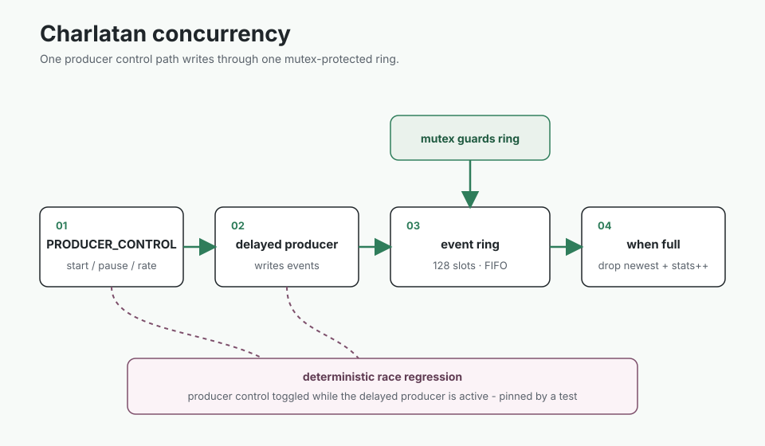

# Charlatan

A Linux streaming character device and C++20 userspace harness for studying the kernel boundary.

The module exposes a global 128-event FIFO through read, write, poll, epoll, and a versioned ioctl ABI.
A read-only mmap page publishes a sequence-checked observation snapshot without handing queue ownership to userspace.

## Measured snapshot

| Workload | Result |
| --- | ---: |
| 10,000 alternating write/read event round trips | 8.30e5 events/s |

Apple M1 host, Lima Apple Virtualization, Ubuntu 26.04 ARM64 guest, Linux 7.0.0-28, GCC 15.2.0, Debug build.
This measures syscall and driver overhead in one VM, not bare-metal peak throughput.

<table>
  <tr>
    <td></td>
    <td></td>
  </tr>
</table>

## What the harness checks

- Queue boundaries, wraparound, overflow, reset, and blocked readers
- Poll and epoll readiness
- Mmap snapshot stability and writable-mapping rejection
- Producer races, injected failures, stress, and sanitizer runs
- Kernel and userspace ABI agreement

Kernel integration and the checked-in benchmark run inside an ARM64 Ubuntu VM.
The benchmark is VM evidence, not a bare-metal claim.

[Build, load, test, measure, and inspect the limitations](GUIDE.md).
