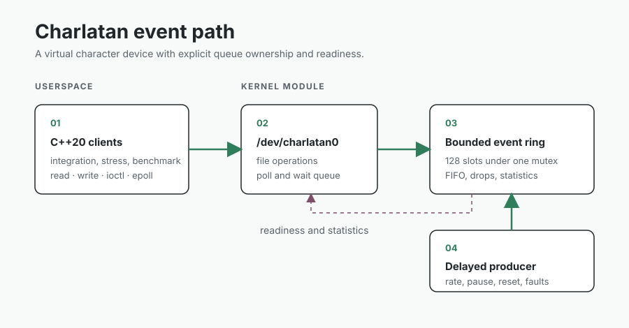

# Charlatan

Charlatan is a virtual Linux streaming character device with a C++20 test client.

It is a small driver project for practicing the boundary between kernel code and userspace.

It targets systems-software, embedded-Linux, and low-level C++ work.

Charlatan builds against the running distribution kernel and matching headers in an ARM64 Ubuntu VM.



## Quick start

Run these commands inside the Ubuntu VM from the repository root.

```sh
./scripts/check-deps.sh
./scripts/build.sh
sudo ./scripts/load.sh
./scripts/smoke.sh
./scripts/test-integration.sh
sudo ./scripts/unload.sh
```

If the dependency check fails, run `./scripts/install-deps.sh` and repeat the check.

`load.sh` refuses to replace an existing module instance.

`unload.sh` refuses to unload while `/dev/charlatan0` is open.

## What it does

- Registers `/dev/charlatan0` through an externally built kernel module.
- Stores fixed-size events in a 128-slot FIFO ring.
- Supports blocking and nonblocking `read()`, exact-size `write()`, `poll()`, and level-triggered `epoll`.
- Uses a versioned ioctl ABI for reset, statistics, producer control, overflow injection, and deterministic faults.
- Models reset with a per-descriptor generation so blocked readers receive `ECANCELED`.
- Drops the newest event when the queue is full and reports the loss through statistics.
- Exercises concurrent producer control with a deterministic race regression.
- Provides integration, stress, benchmark, and ASan/UBSan runs.

## Benchmark snapshot

The benchmark alternates one `write()` and one `read()` so the queue does not overflow.

| Configuration | Result | What it measures |
| --- | ---: | --- |
| 10,000 write/read event round trips | 8.30e5 events/s | Syscall and driver overhead in the VM |

Run facts: Apple M1 host, Lima Apple Virtualization, Ubuntu 26.04 ARM64 guest, Linux 7.0.0-28-generic, GCC 15.2.0, CMake 4.2.3, Debug build.

This is a virtualized single-machine result, not a bare-metal or peak-throughput claim.

Run `./scripts/benchmark.sh 10000` with the module loaded to write the current result to `results/stream.json`.

The methodology and earlier observations are in [docs/measurements.md](docs/measurements.md).

## Architecture

```text
userspace clients          kernel module                 device internals
----------------          -------------                 -----------------
read / write /            /dev/charlatan0               mutex-protected ring
ioctl / epoll     ----->  file_operations       ----->  (128-slot FIFO)
                                   |
                                   v
                          wait queue + delayed producer
```

| Component | Role |
| --- | --- |
| C++20 clients | Drive the device through system calls and assertions. |
| `/dev/charlatan0` | Character device exposing the file operations. |
| Bounded ring | 128-slot FIFO holding events under one mutex. |
| Wait queue | Wakes blocked readers on events, reset, and capacity changes. |
| Delayed producer | Simulates a hardware producer at a configurable rate. |

The kernel owns queue mutation and wakes waiters after events, resets, and capacity changes.

Readers compete for one global FIFO.

The delayed worker simulates a device producer, while `write()` gives tests a deterministic injection path.

## Verification

| Environment | Evidence |
| --- | --- |
| Ubuntu 26.04 ARM64 VM | 10 consecutive integration runs passed. |
| Ubuntu 26.04 ARM64 VM | Active-worker stress run completed 914,326 writes, 908,379 reads, and 335 resets with zero unexpected errno values. |
| Ubuntu 26.04 ARM64 VM | Userspace ASan/UBSan integration run passed. |
| GitHub Actions Ubuntu 24.04 | C++20 build and smoke usage test run on pushes and pull requests. |

The integration client covers queue boundaries, invalid user destinations, wraparound, reset, `poll`, `epoll`, overflow accounting, ioctl validation, injected `EIO`, and concurrent producer control.

The stress client runs two consumers, a writer, a resetter, and rapid open/close traffic for two seconds.

## Development

Build output records the Ubuntu release, architecture, kernel, compiler, and CMake version in `build/environment.txt`.

Set `CHARLATAN_KERNEL_CC` to choose the compiler used for the external module.

Run a sanitizer build in a separate directory with:

```sh
cmake -S userspace -B build/asan-ubsan -DCMAKE_BUILD_TYPE=Debug -DCHARLATAN_SANITIZER=address,undefined
cmake --build build/asan-ubsan --parallel
sudo ./scripts/load.sh
ASAN_OPTIONS=detect_leaks=1 ./build/asan-ubsan/charlatan-tests
sudo ./scripts/unload.sh
```

## Documentation

- [Architecture and contracts](docs/architecture.md) explains device operations, readiness, reset, and teardown.
- [Control ABI](docs/abi.md) lists ioctl semantics and statistics fields.
- [Validation strategy](docs/validation.md) describes integration, stress, sanitizer, and race coverage.
- [Measurements](docs/measurements.md) records benchmark method and VM caveats.
- [Mmap decision](docs/mmap.md) explains why the mmap path is deferred.
- [Interview notes](docs/interview-notes.md) records the key engineering choices.

## Limitations

The project has no mmap transport.

The development loader sets `/dev/charlatan0` to mode `0666` so a non-root harness can run in the VM.

A deployed device should use a least-privilege udev rule and group ownership instead.

Kernel lock debugging and kernel sanitizers depend on the target distribution kernel configuration and are not claimed here.

## License

Charlatan is released under the [MIT License](LICENSE).
