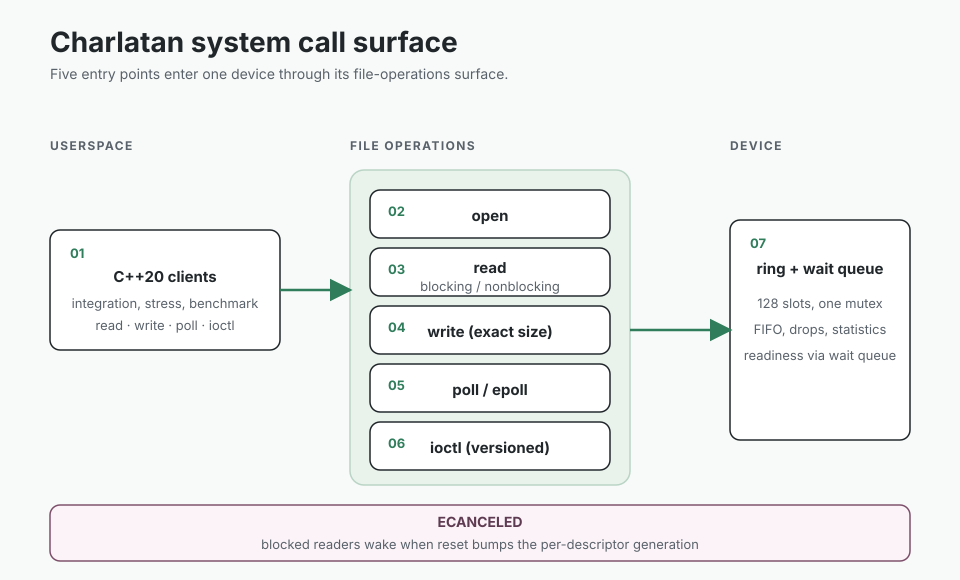
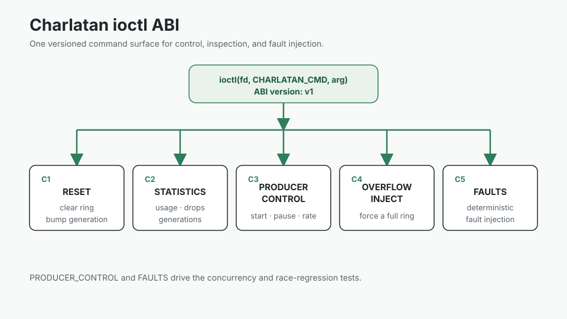

# Charlatan

A Linux streaming character device and C++20 userspace harness for studying the kernel boundary.

The module exposes a global 128-event FIFO through read, write, poll, epoll, and a versioned ioctl ABI.
A read-only mmap page publishes a sequence-checked observation snapshot without handing queue ownership to userspace.

<table>
  <tr>
    <td></td>
    <td></td>
  </tr>
</table>

## What the harness checks

- Queue boundaries, wraparound, overflow, reset, and blocked readers
- Poll and epoll readiness
- Mmap snapshot stability and writable-mapping rejection
- Producer races, injected failures, stress, and sanitizer runs
- Kernel and userspace ABI agreement

Kernel integration and the checked-in benchmark run inside an ARM64 Ubuntu VM.
The benchmark is VM evidence, not a bare-metal claim.

[Build, load, test, measure, and inspect the limitations](GUIDE.md).
